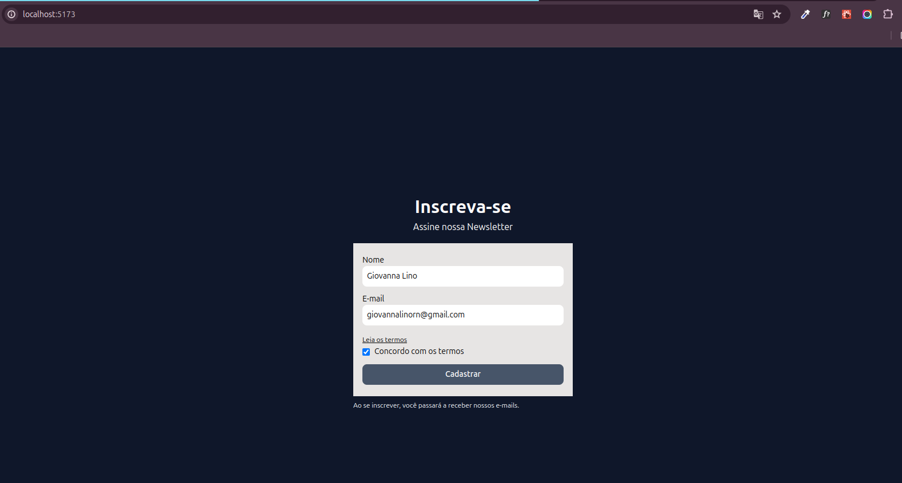

# Formulário de Newsletter utilizando React.js, TypeScript e Tailwind CSS

Este é um simples projeto de formulário de newsletter desenvolvido com React.js, TypeScript e Tailwind CSS. O projeto permite que os usuários se inscrevam em uma newsletter fornecendo seu nome, e-mail e concordando com os termos.

## Tecnologias Utilizadas

- **React.js**: Uma biblioteca JavaScript para construção de interfaces de usuário.
- **TypeScript**: Um superset de JavaScript que adiciona tipagem estática opcional.
- **Tailwind CSS**: Um framework CSS utilitário para construção de interfaces de usuário.



## Pré-requisitos

- Node.js e npm instalados na sua máquina.


## Como Executar o Projeto

1. Clone este repositório para sua máquina local:

    ```bash
    git clone https://github.com/gigigabytes/newsletter_react.git
    ```

2. Navegue até o diretório do projeto:

    ```bash
    cd newsletter_react
    ```

3. Instale as dependências do projeto:

    ```bash
    npm install
    ```

4. Inicie o servidor de desenvolvimento:

    ```bash
    npm run dev
    ```

